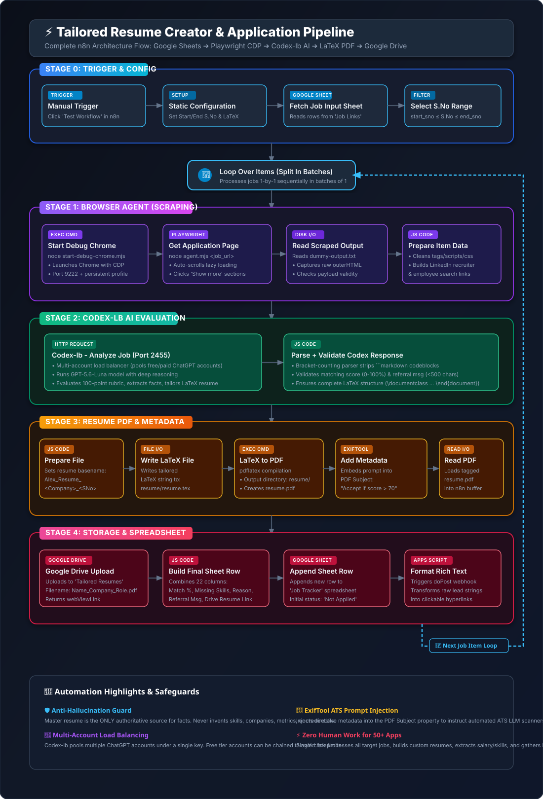

# 🚀 Tailored Resume Creator & Job Application Automation

> **An automated end-to-end pipeline built with n8n, Playwright Browser Agent, Codex-lb (Multi-Account AI), LaTeX, ExifTool, and Google Sheets & Drive.**

---

## 📖 Table of Contents

1. [🔥 Problem Statement](#-problem-statement)
2. [🌟 What Does This Project Do?](#-what-does-this-project-do)
3. [🏗️ How It Works](#️-how-it-works)
4. [📋 Prerequisites](#-prerequisites)
5. [🛠️ Step 1: Install Node.js, Python, and uv](#️-step-1-install-nodejs-python-and-uv)
6. [🤖 Step 2: Install & Configure n8n](#-step-2-install--configure-n8n)
7. [☁️ Step 3: GCP Console — Create Credentials for Sheets & Drive](#️-step-3-gcp-console--create-credentials-for-sheets--drive)
8. [📊 Step 4: Google Sheets Setup (incl. App Script Deployment)](#-step-4-google-sheets-setup-incl-app-script-deployment)
9. [📄 Step 5: Install LaTeX & ExifTool — Add to System PATH](#-step-5-install-latex--exiftool--add-to-system-path)
10. [🌐 Step 6: Configure the Chrome Browser Agent](#-step-6-configure-the-chrome-browser-agent)
11. [⚙️ Step 7: Import & Configure the n8n Workflow](#️-step-7-import--configure-the-n8n-workflow)
12. [▶️ Step 8: Sample Run](#️-step-8-sample-run)
13. [❓ Step 9: FAQs & Troubleshooting](#-step-9-faqs--troubleshooting)
14. [✅ Pre-Flight Checklist](#-pre-flight-checklist)

---

## 🔥 Problem Statement

Job hunting at scale is brutally manual:

- You open each job link, read the full description, and identify the exact keywords and skills the employer wants.
- You edit your resume carefully to highlight the most relevant experience — without fabricating anything.
- You convert it to PDF, name it properly, upload it to Drive, and copy the shareable link.
- You hunt for referral contacts on LinkedIn and write personalised outreach messages.
- You log all of this into a tracker spreadsheet and keep it updated.

Multiply that by 20, 50, or 100 applications and you have burned days of your life on copy-paste grunt work with zero guarantee of a response.

**There has to be a better way. This project is that better way.**

---

## 🌟 What Does This Project Do?

You paste job links into a Google Sheet. You click one button in n8n. The automation:

1. **Opens every job link** in a real Chrome browser (handles SPAs, cookie banners, "Show more" buttons).
2. **Extracts the full job description** — salary, experience requirements, work mode, applicant count, posting date.
3. **Scores your profile** against the job on a 0–100% weighted rubric and explains what matches and what is missing.
4. **Tailors your LaTeX resume** to the specific role, injecting the right ATS keywords without fabricating experience.
5. **Compiles a pixel-perfect PDF** with `pdflatex`.
6. **Injects PDF metadata** with ExifTool (a clever ATS optimisation prompt in the `Subject` field).
7. **Uploads the PDF** to Google Drive and generates a shareable link.
8. **Generates referral search links** (LinkedIn recruiter + employee searches) and a ready-to-send referral message.
9. **Logs a complete row** into your Job Tracker Google Sheet — match score, missing skills, keywords, referral leads, PDF link, application status.

```
┌─────────────────┐      ┌─────────────────┐      ┌─────────────────┐
│  Google Sheet   │ ───► │ Playwright      │ ───► │ Codex-lb (AI)   │
│  Job Links      │      │ Browser Agent   │      │ Match + Tailor  │
└─────────────────┘      └─────────────────┘      └─────────────────┘
                                                           │
                                                           ▼
┌─────────────────┐      ┌─────────────────┐      ┌─────────────────┐
│ Google Sheet    │ ◄─── │ Google Drive    │ ◄─── │ pdflatex +      │
│ Job Tracker     │      │ Upload PDF      │      │ ExifTool Meta   │
└─────────────────┘      └─────────────────┘      └─────────────────┘
```

---

## 🏗️ How It Works

Here is the exact journey each job takes through the pipeline:

<p align="center">
  
</p>

### Step-by-step data flow

| # | n8n Node | What happens |
| :---: | :--- | :--- |
| 1 | `Static Configuration` | Sets the row range to process and holds your master LaTeX resume |
| 2 | `Fetch Job Input Sheet` | Reads job rows from the **Job Links** Google Sheet via OAuth |
| 3 | `Start Debug Chrome` | Launches Chrome in CDP debug mode on port 9222 |
| 4 | `Get Application Page` | Runs `agent.mjs` via Playwright CDP to scrape the full job description |
| 5 | `Read/Write Files from Disk` | Reads the scraped output from `dummy-output.txt` |
| 6 | `Codex-lb — Analyze Job` | Sends job + resume to AI; gets score, keywords, tailored LaTeX back |
| 7 | `Prepare Resume File` | Extracts values; names the output file `YourName_Company_Role.pdf` |
| 8 | `Write LaTeX File` | Saves the tailored `.tex` to the `resume/` folder |
| 9 | `LaTeX to PDF` | Runs `pdflatex` to compile `resume.pdf` |
| 10 | `Add Meta Data` | Runs `exiftool` to inject ATS prompt into PDF `Subject` field |
| 11 | `Read PDF` | Reads the compiled PDF binary for upload |
| 12 | `Google Drive — Upload PDF` | Uploads to your Drive folder and captures the shareable link |
| 13 | `Google Sheets — Append Row` | Appends the full result row to your **Job Tracker** sheet |
| 14 | `Convert Referral Leads to Rich Text` | Calls the deployed Apps Script to convert raw URLs into clickable hyperlinks |

---

## 📋 Prerequisites

Make sure every item below is in place **before** starting the setup steps.

| Component | Tool / Software | Required For |
| :--- | :--- | :--- |
| **Node.js (v18+)** | nodejs.org | Running n8n & the browser agent |
| **Python (v3.10+)** | python.org | Running `uv` and helper tools |
| **uv** | Astral uv (`uvx`) | Running `codex-lb` without manual venvs |
| **n8n** | n8n workflow engine | Main automation workflow |
| **Codex-lb** | `uvx codex-lb` | Pooling multiple ChatGPT accounts for high-rate AI |
| **Google Chrome** | Chrome browser | Real browser session for Playwright CDP |
| **pdflatex** | MiKTeX or TeX Live | Compiling LaTeX resumes to PDF |
| **ExifTool** | Phil Harvey's ExifTool | Injecting metadata into the PDF |
| **GCP Project** | Google Cloud Console | OAuth credentials for Google Sheets & Drive |

---

## 🛠️ Step 1: Install Node.js, Python, and uv

### 1. Install Node.js (v18 or v20 LTS)

1. Download Node.js from [nodejs.org](https://nodejs.org/).
2. Run the installer and check **"Automatically install the necessary tools"**.
3. Verify in PowerShell:
   ```powershell
   node -v
   npm -v
   ```

### 2. Install Python (v3.10+)

1. Download from [python.org](https://www.python.org/) or run:
   ```powershell
   winget install Python.Python.3.12
   ```
2. ⚠️ Check **"Add python.exe to PATH"** during setup!
3. Verify:
   ```powershell
   python --version
   ```

### 3. Install `uv` (Fast Python Package Runner)

`uv` is required to run `uvx codex-lb` without manually managing virtual environments:

```powershell
powershell -ExecutionPolicy ByPass -c "irm https://astral.sh/uv/install.ps1 | iex"
```

Or via WinGet:

```powershell
winget install --id=astral-sh.uv
```

Verify:

```powershell
uv --version
```

---

## 🤖 Step 2: Install & Configure n8n

### Install n8n globally

```powershell
npm install -g n8n
```

### Set Required Environment Variables

By default, n8n disables dangerous nodes like `Execute Command` and file read/write. Because this workflow runs `pdflatex`, `exiftool`, and `node` via shell commands, **these must be explicitly enabled**.

#### Set permanently in Windows:

1. Press `Win + R`, type `sysdm.cpl`, press **Enter**.
2. Go to the **Advanced** tab → **Environment Variables**.
3. Under **User variables**, click **New** and add each variable below:

| Variable Name | Value | Purpose |
| :--- | :--- | :--- |
| `N8N_ENFORCE_SETTINGS_FILE_PERMISSIONS` | `true` | Prevents config permission errors on Windows |
| `N8N_ENABLE_EXECUTE_COMMAND` | `true` | **Critical:** enables the Execute Command node |
| `NODES_EXCLUDE` | `[]` | Ensures all built-in nodes (file operations etc.) are enabled |
| `N8N_RESTRICT_FILE_ACCESS_TO` | `""` | Prevents File Access errors |

4. Restart PowerShell after setting variables.

> 💡 **Quick alternative** — set variables inline for a single session:
> ```powershell
> $env:N8N_ENFORCE_SETTINGS_FILE_PERMISSIONS="true"
> $env:N8N_ENABLE_EXECUTE_COMMAND="true"
> $env:NODES_EXCLUDE="[]"
> $env:N8N_RESTRICT_FILE_ACCESS_TO=""
> npx n8n
> ```

### Start n8n

```powershell
n8n start
```

Open your browser and go to: 👉 **`http://localhost:5678`**

Create your owner account when prompted.

---

## ☁️ Step 3: GCP Console — Create Credentials for Sheets & Drive

n8n connects to Google Sheets and Google Drive using **OAuth 2.0**. You need a GCP project with a **Client ID** and **Client Secret** — these are what n8n asks for when you add a Google credential.

### 3.1 Create a GCP Project

1. Go to [console.cloud.google.com](https://console.cloud.google.com/).
2. Click the project dropdown (top-left) → **New Project**.
3. Give it a name (e.g. `n8n-resume-automation`) and click **Create**.
4. Make sure the new project is selected in the dropdown.

### 3.2 Enable the Required APIs

1. In the left sidebar, go to **APIs & Services** → **Library**.
2. Search for and enable each of the following:
   - **Google Sheets API** → click it → **Enable**
   - **Google Drive API** → click it → **Enable**

### 3.3 Configure the OAuth Consent Screen

Before creating credentials, you must set up the consent screen Google shows when users authorise the app.

1. Go to **APIs & Services** → **OAuth consent screen**.
2. Select **External** → click **Create**.
3. Fill in:
   - **App name:** `n8n Resume Automation`
   - **User support email:** your Gmail address
   - **Developer contact information:** your Gmail address
4. Click **Save and Continue** through the Scopes and Test Users screens (no changes needed for personal use).
5. Back on the summary screen, either click **Publish App** or leave it in Testing and add your Gmail as a test user.

### 3.4 Create OAuth 2.0 Client Credentials

1. Go to **APIs & Services** → **Credentials**.
2. Click **+ Create Credentials** → **OAuth client ID**.
3. Set **Application type** to **Web application**.
4. Give it a name (e.g. `n8n OAuth Client`).
5. Under **Authorised redirect URIs**, click **+ Add URI** and enter:
   ```
   http://localhost:5678/rest/oauth2-credential/callback
   ```
   > ⚠️ This is the exact callback URL n8n uses. Without it, the OAuth flow will fail.
6. Click **Create**.
7. A dialog appears — **copy and save both values:**
   - **Client ID** (e.g. `123456789-abc...apps.googleusercontent.com`)
   - **Client Secret** (e.g. `GOCSPX-...`)

### 3.5 Add Google Sheets Credential in n8n

1. In n8n, go to **Settings** → **Credentials** → **Add credential**.
2. Search for **Google Sheets OAuth2 API** and select it.
3. Paste your **Client ID** and **Client Secret**.
4. Click **Sign in with Google** — a browser popup will ask you to authorise.
5. Grant all requested permissions. Credential status → ✅ **Connected**.

### 3.6 Add Google Drive Credential in n8n

Repeat the same process for Drive:

1. **Add credential** → search for **Google Drive OAuth2 API**.
2. Paste the **same Client ID and Client Secret** (you can reuse the same OAuth client for both Sheets and Drive).
3. Click **Sign in with Google** and authorise.
4. Credential status → ✅ **Connected**.

---

## 📊 Step 4: Google Sheets Setup (incl. App Script Deployment)

You need two Google Sheets and one Google Drive folder.

### 4.1 Input Sheet: "Job Links"

Create a Google Sheet named **Job Links** with this exact header row in row 1:

| S.No | Company | Role | Application link |
| :---: | :---: | :---: | :---: |
| 1 | Stripe | Software Engineer - Backend | https://stripe.com/jobs/... |
| 2 | Datadog | Frontend Engineer | https://datadog.com/jobs/... |

> 💡 You can also upload the included `Job Links.xlsx` directly to Google Drive and convert it to a Google Sheet.

### 4.2 Output Sheet: "Job Tracker"

Create a Google Sheet named **Job Tracker** with these column headers in row 1:

| Col | Header | Description |
| :---: | :--- | :--- |
| A | `S.No` | Serial number |
| B | `Company` | Company name |
| C | `Role` | Target role |
| D | `Required Yrs Experience` | Experience requirement extracted by AI |
| E | `Salary` | Compensation info |
| F | `Application Link` | Direct link to job posting |
| G | `No. of Applicants` | Applicant count from page |
| H | `Job Posted Date` | Verified posted date |
| I | `Location` | City / State / Country |
| J | `Work Mode` | Remote / Hybrid / Onsite |
| K | `Job Description` | Concise summary of duties & requirements |
| L | `Matching %` | Weighted score (0–100%) |
| M | `Matching Reason` | Explanation of score and key matches |
| N | `Missing Skills` | Genuine skill gaps |
| O | `Resume Keywords` | ATS keywords integrated into tailored resume |
| P | `Referral Leads` | LinkedIn search URLs (formatted as clickable links) |
| Q | `Referral Message` | Ready-to-send referral request (< 500 chars) |
| R | `Tailored Resume Link` | Clickable Google Drive PDF link |
| S | `Application Status` | Defaults to `"Not Applied"` |
| T | `Applied Date` | Auto-stamped when status → `"Applied"` |
| U | `Follow-up Date` | Auto-stamped for follow-ups |
| V | `Notes` | Personal application notes |

> 💡 You can also upload `Job Tracker.xlsx` to Google Drive and convert it.

### 4.3 Deploy the Google Apps Script Web App

The Apps Script makes the **Referral Leads** column automatically convert raw URLs into clickable "Recruiters" / "Employees" hyperlinks, and auto-stamps applied/follow-up dates when you change status.

1. Open your **Job Tracker** Google Sheet.
2. In the top menu: **Extensions** → **Apps Script**.
3. Delete any default code in `Code.gs`.
4. Copy the entire contents of `Job Tracker App Script.gs` from this repo and paste it in.
5. Click **Save** (💾).
6. Click the blue **Deploy** button (top-right) → **New deployment**.
7. Click the gear icon ⚙️ next to "Select type" → choose **Web app**.
8. Configure the deployment:
   - **Description:** `Referral Leads & Status Formatter`
   - **Execute as:** `Me (your-email@gmail.com)`
   - **Who has access:** `Anyone` *(Critical — this lets n8n call it without extra auth headers)*
9. Click **Deploy** and authorise Google permissions when prompted.
10. **Copy the Web App URL** (looks like `https://script.google.com/macros/s/AKfycb.../exec`).
    Save this URL — you will paste it into n8n in Step 7.

### 4.4 Create the Google Drive Folder

1. Go to [drive.google.com](https://drive.google.com/).
2. Create a new folder named `Tailored Resumes`.
3. Open the folder and copy its **Folder ID** from the URL:
   `https://drive.google.com/drive/folders/`**`1a2b3c4d5e6f7g8h9i`**
   (the bold part is your Folder ID — save it for Step 7).

---

## 📄 Step 5: Install LaTeX & ExifTool — Add to System PATH

### 5.1 Install pdflatex (MiKTeX)

LaTeX compiles your tailored resume into a pixel-perfect, ATS-parseable PDF.

1. Download **MiKTeX** from [miktex.org/download](https://miktex.org/download)
   *(or: `winget install MiKTeX.MiKTeX`)*
2. During installation, when asked **"Install missing packages on-the-fly"** → select **Yes**. This prevents compilation failures for missing LaTeX packages.
3. Restart PowerShell and verify:
   ```powershell
   pdflatex --version
   ```
   Expected output: `pdfTeX 3.141592653...`

> If `pdflatex` is not found after install, add the MiKTeX bin directory to your system PATH:
> `C:\Users\<YourUsername>\AppData\Local\Programs\MiKTeX\miktex\bin\x64\`

### 5.2 Install ExifTool

ExifTool injects metadata into the generated PDF — specifically an AI prompt into the `Subject` field as an ATS optimisation technique.

1. Download the Windows executable from [exiftool.org](https://exiftool.org/).
2. Extract the `.zip`. You will find `exiftool(-k).exe`.
3. **Rename it to `exiftool.exe`** (remove the `(-k)` part).
4. Move `exiftool.exe` to a permanent folder, e.g. `C:\Tools\`.
5. Add `C:\Tools` to your Windows **System PATH**:
   - `Win + R` → `sysdm.cpl` → **Advanced** → **Environment Variables**
   - Under **System variables**, find `Path` → **Edit** → **New** → type `C:\Tools`
   - Click **OK** on all dialogs.
6. Restart PowerShell and verify:
   ```powershell
   exiftool -ver
   ```

### 5.3 Add Chrome to System PATH (Optional but Recommended)

Adding Chrome to PATH lets the browser agent launch Chrome with just `chrome` instead of a full path.

1. Find your Chrome executable path: open Chrome → `chrome://version/` → look for **Executable Path**.
   Default location: `C:\Program Files\Google\Chrome\Application\`
2. Add that folder to your system `Path` following the same steps above.
3. Verify:
   ```powershell
   chrome --version
   ```

---

## 🌐 Step 6: Configure the Chrome Browser Agent

The browser agent uses Playwright connected via **Chrome DevTools Protocol (CDP)** on port `9222`. This handles Single Page Applications (Workday, Greenhouse, Lever, LinkedIn), respects cookies, and expands "Show more" sections.

### 6.1 Set Chrome Path & Profile in `start-debug-chrome.mjs`

Open `browser-agent/start-debug-chrome.mjs`.

**Line 4** — set the Chrome executable path:
```javascript
// Replace with your actual Chrome path (from chrome://version/) or just 'chrome' if it is on PATH
const CHROME = 'C:\\Program Files\\Google\\Chrome\\Application\\chrome.exe';
```

**Line 6** — set the Chrome profile directory:
```javascript
// Replace with the absolute path to the chrome-profile folder inside browser-agent/
const PROFILE = 'absolute path to the chrome-profile';
```

> ⚠️ **Windows paths in JavaScript:** use double backslashes (`\\`) or forward slashes (`/`).

### 6.2 Install Browser Agent Dependencies

Open PowerShell in the `browser-agent/` directory:

```powershell
cd "R:\Pichi Dot EXE\projects\tailored-resume-creator-automation\browser-agent"
npm install
```

### 6.3 Test the Browser Agent (Recommended)

Test Chrome starts correctly:
```powershell
node start-debug-chrome.mjs
```
Expected output: `Chrome CDP ready after 1 second(s).`

Then test scraping a real URL:
```powershell
node agent.mjs "https://www.google.com" > dummy-output.txt
```
Open `dummy-output.txt` — it should contain valid JSON with scraped content.

---

## ⚙️ Step 7: Import & Configure the n8n Workflow

### 7.1 Import the Workflow

1. Open n8n at `http://localhost:5678`.
2. Click **Workflows** in the sidebar → **Add Workflow** → **Import from File**.
3. Select `n8n-workflow.json` from this repo.

### 7.2 Placeholders Reference

Before running, replace every placeholder across the workflow nodes:

| Placeholder | What to put there | Example |
| :--- | :--- | :--- |
| `<NAME>` | Your name (for PDF file naming) | `Alex_Smith` |
| `<BROWSER_AGENT_PATH>` | Absolute path to `browser-agent/` folder | `R:\Pichi Dot EXE\projects\...\browser-agent` |
| `<START_DEBUG_CHROME_FILE_PATH>` | Absolute path to `start-debug-chrome.mjs` | `...\browser-agent\start-debug-chrome.mjs` |
| `<DUMMY_OUTPUT_FILE_PATH>` | Absolute path to `dummy-output.txt` | `...\browser-agent\dummy-output.txt` |
| `<LOCAL_TEMP_FOLDER_FOR_RESUME>` | Absolute path to `resume/` folder | `...\tailored-resume-creator-automation\resume` |
| `<EXIFTOOL_EXE_FILE_PATH>` | Full path to `exiftool.exe` | `C:\Tools\exiftool.exe` (or just `exiftool` if in PATH) |

### 7.3 Node-by-Node Configuration

#### `Static Configuration`
- `start_sno`: First row from Job Links to process (e.g. `1`)
- `end_sno`: Last row to process (e.g. `5`)
- `master_resume_latex`: Paste your full LaTeX resume source here

#### `Fetch Job Input Sheet`
- Credential: select your **Google Sheets OAuth2 API** credential (created in Step 3)
- Document: pick your `Job Links` spreadsheet
- Sheet: select the tab (`Sheet1`)

#### `Start Debug Chrome`
- Command: replace `<START_DEBUG_CHROME_FILE_PATH>` with your actual path:
  ```powershell
  node "R:\Pichi Dot EXE\projects\tailored-resume-creator-automation\browser-agent\start-debug-chrome.mjs"
  ```

#### `Get Application Page`
- Update the paths in the command expression to your actual `<BROWSER_AGENT_PATH>` and `<DUMMY_OUTPUT_FILE_PATH>`.

#### `Read/Write Files from Disk`
- File path: `<DUMMY_OUTPUT_FILE_PATH>`

#### `Codex-lb — Analyze Job`
- URL: `http://127.0.0.1:2455/v1/responses`
- Authentication: Generic HTTP Bearer Auth with any dummy token (e.g. `sk-codex`). Codex-lb manages real auth locally.

#### `Prepare Resume File`
- In the JavaScript, update `<NAME>` to your name (e.g. `Alex_Smith`).

#### `Write LaTeX File`
- File name: absolute path to `resume/resume.tex`

#### `LaTeX to PDF`
- Command: update `<LOCAL_TEMP_FOLDER_FOR_RESUME>` with your absolute resume folder path.

#### `Add Meta Data`
- Command: update `<LOCAL_TEMP_FOLDER_FOR_RESUME>` with your absolute resume folder path.

#### `Read PDF`
- File path: absolute path to `resume/resume.pdf`

#### `Google Drive — Upload PDF`
- Credential: select your **Google Drive OAuth2 API** credential (created in Step 3)
- Folder: choose the `Tailored Resumes` folder (paste the Folder ID from Step 4.4)
- File name expression: update `<NAME>` to your name.

#### `Google Sheets — Append Row`
- Credential: select your **Google Sheets OAuth2 API** credential
- Document: select your `Job Tracker` spreadsheet
- Sheet: `Sheet1`

#### `Convert Referral Leads to Rich Text`
- URL: your Apps Script Web App URL from Step 4.3:
  `https://script.google.com/macros/s/AKfycb.../exec`
- JSON body:
  ```json
  {
    "spreadsheetId": "YOUR_JOB_TRACKER_SPREADSHEET_ID",
    "sheetName": "Sheet1"
  }
  ```
  *(Find your Spreadsheet ID in the Google Sheets URL: `https://docs.google.com/spreadsheets/d/YOUR_ID_HERE/edit`)*

---

## ▶️ Step 8: Sample Run

### Before you click "Execute"

Make sure the following are all running simultaneously:

| Terminal | Command | Purpose |
| :--- | :--- | :--- |
| Terminal 1 | `uvx codex-lb` | AI load balancer (must be running on port 2455) |
| Terminal 2 | `n8n start` | Workflow engine (must be running on port 5678) |

Chrome will be started automatically by the workflow via the `Start Debug Chrome` node.

### Run the workflow

1. Open your `Job Links` Google Sheet and add 1–2 test job postings.
2. In n8n, open the imported workflow.
3. On the `Static Configuration` node, set `start_sno: 1` and `end_sno: 1` (just one job for the first test run).
4. Click **Test workflow** on the `Manual Trigger` node.

### What you will see happen

- Chrome launches in the background and navigates to the job URL.
- The browser scrolls, expands "Show more" sections, and captures the full job description.
- Codex-lb receives the job + your master resume, calculates a fit score, and generates tailored LaTeX code.
- `pdflatex` compiles `resume.pdf` in the `resume/` directory.
- `exiftool` injects the ATS metadata prompt.
- The PDF uploads to your Google Drive `Tailored Resumes` folder.
- A complete row appears in your `Job Tracker` Google Sheet with score, keywords, referral links, and PDF link.

### Check the output

- Open your **Job Tracker** sheet — a new row should have been appended.
- Click the link in **column R** — it should open your tailored PDF in Google Drive.
- Column P (**Referral Leads**) should show clickable "Recruiters" and "Employees" hyperlinks.

---

## ❓ Step 9: FAQs & Troubleshooting

### Q1: `Command failed: pdflatex not found`
**Cause:** MiKTeX is installed but not on PATH.  
**Fix:** Add MiKTeX's bin folder to your system PATH:
```
C:\Users\<YourUsername>\AppData\Local\Programs\MiKTeX\miktex\bin\x64\
```
Restart PowerShell and n8n after updating PATH.

---

### Q2: `Execute Command is disabled in n8n`
**Cause:** `N8N_ENABLE_EXECUTE_COMMAND` was not set before starting n8n.  
**Fix:** Set the variable (Step 2) and restart n8n:
```powershell
$env:N8N_ENABLE_EXECUTE_COMMAND="true"
n8n start
```

---

### Q3: `Chrome CDP did not become available within 30 seconds`
**Cause:** Incorrect Chrome path in `start-debug-chrome.mjs`, or another Chrome instance is already on port 9222.  
**Fix:**
- Verify `const CHROME` on **line 4** of `start-debug-chrome.mjs`.
- Close all Chrome instances:
  ```powershell
  Get-Process chrome | Stop-Process -Force
  ```
- Re-run `node start-debug-chrome.mjs`.

---

### Q4: `ECONNREFUSED 127.0.0.1:2455` or Codex returned empty output
**Cause:** `codex-lb` is not running.  
**Fix:** Open a terminal and run `uvx codex-lb`. Verify it reports listening on port 2455.

---

### Q5: Google Sheets / Drive credential not connecting in n8n
**Cause:** Missing redirect URI in GCP, or API not enabled.  
**Fix:**
1. In GCP Console → **Credentials** → edit your OAuth client.
2. Confirm `http://localhost:5678/rest/oauth2-credential/callback` is listed under **Authorised redirect URIs**.
3. Confirm both **Google Sheets API** and **Google Drive API** are enabled under **APIs & Services → Library**.
4. Re-authorise the credential in n8n.

---

### Q6: `Google Apps Script returned 403` or HTML login page in n8n response
**Cause:** Web App deployed with access restricted to your account only.  
**Fix:** In Apps Script → **Deploy** → **Manage deployments** → **Edit** → change **Who has access** to **Anyone** → Deploy (new version) → update URL in n8n.

---

### Q7: LaTeX compilation errors (`pdflatex exit code 1`)
**Cause:** Unescaped special characters in the master resume, or missing LaTeX packages.  
**Fix:** Test compile independently:
```powershell
pdflatex -interaction=nonstopmode resume.tex
```
LaTeX special characters that must be escaped: `%` → `\%`, `&` → `\&`, `_` → `\_`, `$` → `\$`.

---

### Q8: `exiftool` not recognised in n8n Execute Command node
**Cause:** ExifTool is in `C:\Tools` but n8n does not inherit the updated PATH.  
**Fix:** Restart n8n after updating PATH. Or use the full absolute path in the node command:
```powershell
"C:\Tools\exiftool.exe" -overwrite_original ...
```

---

## ✅ Pre-Flight Checklist

### Installation
- [ ] Node.js v18+ installed — `node -v` works
- [ ] Python v3.10+ installed — `python --version` works
- [ ] `uv` installed — `uv --version` works
- [ ] n8n installed globally — `npm install -g n8n`

### n8n Environment Variables
- [ ] `N8N_ENABLE_EXECUTE_COMMAND=true`
- [ ] `N8N_ENFORCE_SETTINGS_FILE_PERMISSIONS=true`
- [ ] `NODES_EXCLUDE=[]`

### GCP & Google Setup
- [ ] GCP project created with **Google Sheets API** and **Google Drive API** enabled
- [ ] OAuth consent screen configured (External, Published or test user added)
- [ ] OAuth 2.0 Client ID created with `http://localhost:5678/rest/oauth2-credential/callback` as redirect URI
- [ ] **Client ID** and **Client Secret** saved
- [ ] Google Sheets OAuth2 credential added and authorised in n8n ✅
- [ ] Google Drive OAuth2 credential added and authorised in n8n ✅

### Google Sheets & Drive
- [ ] **Job Links** sheet created with correct headers (4 columns)
- [ ] **Job Tracker** sheet created with correct headers (22 columns, A–V)
- [ ] Apps Script copied into Job Tracker, deployed as Web App (access: **Anyone**)
- [ ] Apps Script Web App URL copied and saved
- [ ] `Tailored Resumes` Drive folder created and Folder ID saved

### Tools on PATH
- [ ] `pdflatex --version` works in PowerShell
- [ ] `exiftool -ver` works in PowerShell
- [ ] Chrome executable path confirmed from `chrome://version/`

### Browser Agent
- [ ] `npm install` run inside `browser-agent/`
- [ ] `const CHROME` on **line 4** of `start-debug-chrome.mjs` set to correct Chrome path
- [ ] `const PROFILE` on **line 6** set to absolute path of `browser-agent/chrome-profile/`
- [ ] `node start-debug-chrome.mjs` outputs `Chrome CDP ready after N second(s).`

### n8n Workflow
- [ ] `n8n-workflow.json` imported successfully
- [ ] All `<PLACEHOLDER>` values replaced in workflow nodes
- [ ] `Static Configuration` node has `start_sno`, `end_sno`, and `master_resume_latex` set
- [ ] Google Sheets nodes connected to correct spreadsheets
- [ ] Google Drive node connected to `Tailored Resumes` folder (Folder ID set)
- [ ] Apps Script URL pasted into the HTTP Request node

### Final Check
- [ ] `uvx codex-lb` running in a terminal (port 2455)
- [ ] `n8n start` running in a terminal (port 5678)
- [ ] 1–2 test rows added to Job Links sheet
- [ ] Workflow executed and Job Tracker row appeared ✅

---

**🎉 You are ready to automate your job application journey!**
